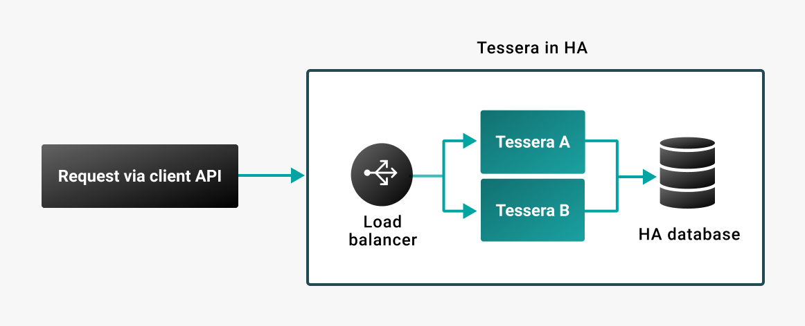

# High availability

Tessera supports deploying more than one instance sharing the same database.

By placing the instances behind a load balancer, downtime can be limited during maintenance operations.



## Servers

When configuring Tessera for high availability, ensure the [`serverAddress`](TesseraAPI.md#server-addresses) is set to `loadbalancer`
and [`bindingAddress`](TesseraAPI.md#server-addresses) is set to `localhost` in the [configuration file](../../Reference/SampleConfiguration.md)
for each included Tessera node.

## Load balancer configuration

The load balancer must expose both client and node interfaces.

When configuring for high availability, configure the nodes in the Tessera cluster (Tessera A and Tessera B in the
previous diagram) with the same set of keys and advertise the load balancer address.

!!! example "Nginx configuration with two Tessera nodes"

    ```
     events { }

     http {
         upstream tessera_8080 {
             server tessera_1:8080 max_fails=3 fail_timeout=5s;
             server tessera_2:8080 max_fails=3 fail_timeout=5s;
         }

         upstream tessera_8888 {
             server tessera_1:8888 max_fails=3 fail_timeout=5s;
             server tessera_2:8888 max_fails=3 fail_timeout=5s;
         }

         server {
             listen 8080;

             location / {
                 proxy_pass http://tessera_8080;
             }
         }

         server {
             listen 8888;

             location / {
                 proxy_pass http://tessera_8888;
             }
         }
     }
    ```

The configuration defines two upstreams: `tessera_8080` and `tessera_8888`.

Both upstreams define health checks: `max_fails=3 fail_timeout=5s`

The [health checks](https://docs.nginx.com/nginx/admin-guide/load-balancer/http-health-check/) help
Nginx balance traffic among upstream servers.
